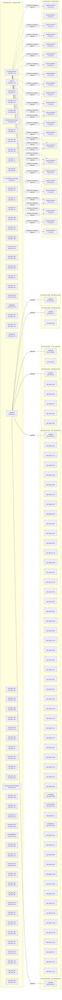

# kaneworld
My Homelab for Docker and containers

Murry Kane
murrykane@gmail.com

My Current Lab extracted from Scanopy and added with Mermaid flowchart TD below:

```mermaid
flowchart LR
    subgraph sub_e36270d3["192.168.1.0/24 - 192.168.1.0/24"]
        n_302cf940["scanopy-daemon<br/>192.168.1.191"]
        n_91459e79["HP8715<br/>192.168.1.102"]
        n_9442858d["CameraFront<br/>192.168.1.70"]
        n_08813cb9["192.168.1.174<br/>192.168.1.174"]
        n_4b40d4ae["192.168.1.188<br/>192.168.1.188"]
        n_0836b34e["dns-primary.dns-cluster<br/>192.168.1.215"]
        n_679d4355["192.168.1.15<br/>192.168.1.15"]
        n_ac793f0b["192.168.1.242<br/>192.168.1.242"]
        n_8c15e595["192.168.1.104<br/>192.168.1.104"]
        n_683d58e9["192.168.1.11<br/>192.168.1.11"]
        n_e9a3314f["192.168.1.66<br/>192.168.1.66"]
        n_c01ac184["dns-tertiary.dns-cluster<br/>192.168.1.4"]
        n_5d6fd70e["192.168.1.147<br/>192.168.1.147"]
        n_cf26bf5d["192.168.1.12<br/>192.168.1.12"]
        n_3a872749["192.168.1.64<br/>192.168.1.64"]
        n_1018c221["192.168.1.209<br/>192.168.1.209"]
        n_36c9299f["192.168.1.175<br/>192.168.1.175"]
        n_d708bff0["192.168.1.185<br/>192.168.1.185"]
        n_63b832f0["192.168.1.135<br/>192.168.1.135"]
        n_5f1a9aec["192.168.1.184<br/>192.168.1.184"]
        n_bb256cf5["192.168.1.226<br/>192.168.1.226"]
        n_fdbf7007["192.168.1.10<br/>192.168.1.10"]
        n_d63bc6da["192.168.1.111<br/>192.168.1.111"]
        n_ae236304["192.168.1.228<br/>192.168.1.228"]
        n_8fbce5b8["MurdogAP<br/>192.168.1.170"]
        n_b4c3b5bc["192.168.1.237<br/>192.168.1.237"]
        n_f523a554["192.168.1.172<br/>192.168.1.172"]
        n_e9719793["USW24PoE<br/>192.168.1.42"]
        n_3af86f91["_gateway<br/>192.168.1.1"]
        n_74be50a3["192.168.1.137<br/>192.168.1.137"]
        n_74f4923c["192.168.1.140<br/>192.168.1.140"]
        n_e0fd4043["192.168.1.186<br/>192.168.1.186"]
        n_5a4e66e1["192.168.1.142<br/>192.168.1.142"]
        n_d80edfa7["192.168.1.168<br/>192.168.1.168"]
        n_bcfbf427["192.168.1.192<br/>192.168.1.192"]
        n_085e6c9d["192.168.1.97<br/>192.168.1.97"]
        n_83087cec["192.168.1.154<br/>192.168.1.154"]
        n_7feb34ba["192.168.1.59<br/>192.168.1.59"]
        n_a5ea3b01["192.168.1.234<br/>192.168.1.234"]
        n_a306ba2c["dns-secondary.dns-cluster<br/>192.168.1.219"]
        n_be35b19e["192.168.1.146<br/>192.168.1.146"]
        n_7a3890ff["192.168.1.114<br/>192.168.1.114"]
        n_f5bc3180["192.168.1.141<br/>192.168.1.141"]
        n_b5d724d5["EPSON277875<br/>192.168.1.136"]
        n_52168846["EPSONB905A5<br/>192.168.1.233"]
        n_66f2e97c["192.168.1.156<br/>192.168.1.156"]
        n_f0fa9dfa["192.168.1.210<br/>192.168.1.210"]
        n_489437f1["192.168.1.153<br/>192.168.1.153"]
        n_f42ca092["192.168.1.159<br/>192.168.1.159"]
        n_82f28792["192.168.1.162<br/>192.168.1.162"]
        n_62aefbf0["192.168.1.88<br/>192.168.1.88"]
        n_319ae05c["192.168.1.118<br/>192.168.1.118"]
        n_cba3a9dd["192.168.1.121<br/>192.168.1.121"]
        n_92a49428["192.168.1.120<br/>192.168.1.120"]
        n_0170f7df["192.168.1.200<br/>192.168.1.200"]
        n_bad214d8["192.168.1.124<br/>192.168.1.124"]
        n_eb54d521["192.168.1.149<br/>192.168.1.149"]
        n_e66a13bf["192.168.1.126<br/>192.168.1.126"]
        n_e0d7a638["192.168.1.85<br/>192.168.1.85"]
        n_91d5f95e["192.168.1.107<br/>192.168.1.107"]
    end
    subgraph sub_8927f0ba["192.168.200.0/24 - 192.168.200.0/24"]
        n_823b307c["_gateway<br/>192.168.200.1"]
    end
    subgraph sub_d8bdd34d["172.23.0.0/16 - 172.23.0.0/16"]
        n_e3455998["scanopy-daemon<br/>172.23.0.20"]
        n_1e48a5fb["scanopy-daemon<br/>172.31.0.3"]
        n_299d7c78["scanopy-daemon<br/>172.31.0.2"]
        n_a7001c32["scanopy-daemon<br/>172.23.0.7"]
        n_305d54b9["scanopy-daemon<br/>172.23.0.11"]
        n_04fb5a4e["scanopy-daemon<br/>172.23.0.6"]
        n_52e7ce51["scanopy-daemon<br/>172.23.0.17"]
        n_5344436c["scanopy-daemon<br/>172.23.0.18"]
        n_b130b755["scanopy-daemon<br/>172.23.0.5"]
        n_7eb2ad82["scanopy-daemon<br/>172.23.0.2"]
        n_270d2fac["scanopy-daemon<br/>172.18.0.2"]
        n_54104b0b["scanopy-daemon<br/>172.23.0.14"]
        n_e81d81c0["scanopy-daemon<br/>172.23.0.3"]
        n_98f82536["scanopy-daemon<br/>172.23.0.4"]
        n_1ea0edb8["scanopy-daemon<br/>172.23.0.10"]
        n_d22d4980["scanopy-daemon<br/>172.23.0.12"]
        n_26a1292e["scanopy-daemon<br/>172.23.0.19"]
        n_c8077f72["scanopy-daemon<br/>172.23.0.15"]
        n_eace3b1c["scanopy-daemon<br/>172.23.0.8"]
        n_96def109["scanopy-daemon<br/>172.23.0.13"]
        n_6d9c2f11["scanopy-daemon<br/>172.23.0.9"]
        n_f9cd80d8["scanopy-daemon<br/>172.23.0.16"]
        n_d2af62da["scanopy-daemon<br/>172.19.0.2"]
    end
    subgraph sub_9f653bdd["192.168.10.0/24 - 192.168.10.0/24"]
        n_4c4b1e4e["_gateway<br/>192.168.10.1"]
        n_26c3e1c9["<br/>192.168.10.118"]
        n_ad489495["<br/>192.168.10.131"]
        n_a7f8cc58["<br/>192.168.10.97"]
        n_1ab6de94["<br/>192.168.10.132"]
        n_780a43ff["<br/>192.168.10.126"]
    end
    subgraph sub_adab3ed0["76.137.250.0/23 - 76.137.250.0/23"]
        n_7bba6c57["_gateway<br/>76.137.250.95"]
        n_25488e52["<br/>76.137.250.1"]
    end
    subgraph sub_eead7820["192.168.107.0/24 - 192.168.107.0/24"]
        n_cecbcb04["_gateway<br/>192.168.107.1"]
        n_ff109dcc["<br/>192.168.107.30"]
        n_3c0a33f3["<br/>192.168.107.127"]
        n_21d845b7["<br/>192.168.107.45"]
        n_6d4746ce["<br/>192.168.107.182"]
        n_1cae0999["<br/>192.168.107.59"]
        n_4e9e8a5d["<br/>192.168.107.34"]
        n_0d287eca["<br/>192.168.107.40"]
        n_a07a5525["<br/>192.168.107.54"]
        n_cfc8ddf5["<br/>192.168.107.93"]
        n_b4c6d236["<br/>192.168.107.98"]
        n_242616c4["<br/>192.168.107.56"]
        n_7e4b2d58["<br/>192.168.107.136"]
        n_e32911e8["<br/>192.168.107.190"]
        n_5056f12c["<br/>192.168.107.32"]
        n_25b496de["<br/>192.168.107.163"]
        n_75aa1a26["<br/>192.168.107.48"]
        n_119ad2e9["<br/>192.168.107.53"]
        n_77e6cf59["<br/>192.168.107.36"]
        n_6d2a5974["<br/>192.168.107.184"]
        n_3a634c40["<br/>192.168.107.86"]
        n_2fdf5884["<br/>192.168.107.133"]
        n_98dfa915["<br/>192.168.107.46"]
        n_ddaadfdb["<br/>192.168.107.69"]
        n_44477481["<br/>192.168.107.75"]
        n_f4fa2800["<br/>192.168.107.61"]
        n_538a7655["<br/>192.168.107.97"]
        n_b04c1c1f["<br/>192.168.107.92"]
        n_b13fc0b9["<br/>192.168.107.104"]
        n_7753cfb1["<br/>192.168.107.39"]
        n_d90fe201["<br/>192.168.107.38"]
        n_4a93e3bc["<br/>192.168.107.72"]
        n_fff75920["<br/>192.168.107.87"]
        n_1d473731["<br/>192.168.107.105"]
        n_ee1de872["<br/>192.168.107.113"]
        n_4bc70de4["<br/>192.168.107.33"]
        n_44777625["<br/>192.168.107.58"]
        n_e65a5e95["FrontLights<br/>192.168.107.88"]
        n_3ac3d356["AmazonKitchen<br/>192.168.107.44"]
        n_f5f4f14f["<br/>192.168.107.71"]
        n_3f45775f["PlugFense2<br/>192.168.107.83"]
        n_e5fbfa72["<br/>192.168.107.141"]
        n_80fde76d["<br/>192.168.107.31"]
        n_4417c23a["<br/>192.168.107.90"]
        n_d2bd98b1["<br/>192.168.107.99"]
        n_83320b21["<br/>192.168.107.159"]
        n_aba26475["<br/>192.168.107.160"]
        n_d863fa80["<br/>192.168.107.181"]
        n_11927b13["<br/>192.168.107.35"]
        n_9c6ac60d["<br/>192.168.107.108"]
        n_fea2f37d["<br/>192.168.107.110"]
        n_babdd37e["<br/>192.168.107.139"]
        n_f4588235["<br/>192.168.107.183"]
        n_fbc0e87b["<br/>192.168.107.57"]
        n_6ca29ce5["<br/>192.168.107.67"]
        n_639527a3["<br/>192.168.107.111"]
    end
    subgraph sub_20a9c0e1["192.168.101.0/24 - 192.168.101.0/24"]
        n_06a950d1["_gateway<br/>192.168.101.1"]
    end
    subgraph sub_748fa6c4["192.168.11.0/24 - 192.168.11.0/24"]
        n_dafa40ab["_gateway<br/>192.168.11.1"]
        n_9f411645["<br/>192.168.11.18"]
    end
    n_3af86f91 ---|_gateway| n_06a950d1
    n_3af86f91 ---|_gateway| n_dafa40ab
    n_3af86f91 ---|_gateway| n_7bba6c57
    n_3af86f91 ---|_gateway| n_4c4b1e4e
    n_3af86f91 ---|_gateway| n_cecbcb04
    n_3af86f91 ---|_gateway| n_823b307c
    n_302cf940 -.->|Docker on scanopy-daemon| n_270d2fac
    n_302cf940 -.->|Docker on scanopy-daemon| n_a7001c32
    n_302cf940 -.->|Docker on scanopy-daemon| n_04fb5a4e
    n_302cf940 -.->|Docker on scanopy-daemon| n_b130b755
    n_302cf940 -.->|Docker on scanopy-daemon| n_98f82536
    n_302cf940 -.->|Docker on scanopy-daemon| n_299d7c78
    n_302cf940 -.->|Docker on scanopy-daemon| n_54104b0b
    n_302cf940 -.->|Docker on scanopy-daemon| n_1ea0edb8
    n_302cf940 -.->|Docker on scanopy-daemon| n_e3455998
    n_302cf940 -.->|Docker on scanopy-daemon| n_5344436c
    n_302cf940 -.->|Docker on scanopy-daemon| n_7eb2ad82
    n_302cf940 -.->|Docker on scanopy-daemon| n_e81d81c0
    n_302cf940 -.->|Docker on scanopy-daemon| n_305d54b9
    n_302cf940 -.->|Docker on scanopy-daemon| n_96def109
    n_302cf940 -.->|Docker on scanopy-daemon| n_eace3b1c
    n_302cf940 -.->|Docker on scanopy-daemon| n_f9cd80d8
    n_302cf940 -.->|Docker on scanopy-daemon| n_52e7ce51
    n_302cf940 -.->|Docker on scanopy-daemon| n_c8077f72
    n_302cf940 -.->|Docker on scanopy-daemon| n_d22d4980
    n_302cf940 -.->|Docker on scanopy-daemon| n_6d9c2f11
    n_302cf940 -.->|Docker on scanopy-daemon| n_26a1292e
    n_302cf940 -.->|Docker on scanopy-daemon| n_54104b0b
    n_302cf940 -.->|Docker on scanopy-daemon| n_1ea0edb8
    n_302cf940 -.->|Docker on scanopy-daemon| n_d22d4980
    n_302cf940 -.->|Docker on scanopy-daemon| n_d2af62da
    n_302cf940 -.->|Docker on scanopy-daemon| n_96def109
    n_302cf940 -.->|Docker on scanopy-daemon| n_6d9c2f11
    n_302cf940 -.->|Docker on scanopy-daemon| n_d22d4980
    n_302cf940 -.->|Docker on scanopy-daemon| n_1ea0edb8
```